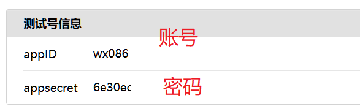

# Ten Abstinence Days - Wechat Push 十斋日微信测试号早8推送

[toc]

/*

 * File: Ten-Abstinence-Days.md
 * Project: notes
 * File Created: Thursday, 3rd July 2025 3:58:01 pm
 * Author: Hanlin Gu (<hg_fine_codes@163.com>)
 * Last Modified: Thursday, 3rd July 2025 4:52:10 pm
 * Modified By: HG (<hg_fine_codes@163.com>>)
 * copyright (c) 2025 Hanlin Gu
*/

<div style="page-break-after:always"></div>

## Description

GitHub: [https://github.com/HanlinGu1992/TenAbstinenceDays_Wechat-Push](<https://github.com/HanlinGu1992/TenAbstinenceDays_Wechat-Push>)

This project aims to implement an automated WeChat notification system that delivers daily reminders at 08:00 during ten abstinence days (lunar calendar dates: 1st, 8th, 14th, 15th, 18th, 23rd, 24th, 28th, 29th, and 30th) for spiritual practice adherence. The notification serves as a prompt for users to engage in the recitation of "The Sutra of Ksitigarbha Bodhisattva" as part of the religious discipline.

本项目是在每月的十斋日，也就是阴历的初一、八、十四、十五、十八、二十三、二十四、二十八、二十九、三十，提醒收信人诵读地藏经。

> Source1: 技术爬爬虾 (B站)
> 
> [1. 免费微信官方推送，做课程表提醒，给女友的天气预报，申请微信公众号测试号，Python定时任务做推送 还能做RSS订阅，运维告警，日程提醒 (视频)](<https://www.bilibili.com/video/BV1Ng4y1r7EP/?spm_id_from=333.788.videopod.sections&vd_source=2071812b61cf3c4c8a8a3a2b319f052d>)
>
> [1. 白嫖微信官方推送，课程提醒，给女友的天气预报 (文字版)](<https://www.bilibili.com/opus/881524080278241301>)
>
> [1. 样例代码 (GitHub)](<https://github.com/tech-shrimp/FreeWechatPush/ >)
>
> 
> [2. Github的王炸功能，但很少人知道怎么用？免费运行程序，流水线编译部署，天气推送 签到薅羊毛 领京豆 CI/CD持续集成持续部署 (视频)](<https://www.bilibili.com/video/BV11e411i7Xx/?vd_source=2071812b61cf3c4c8a8a3a2b319f052d>)
> 
> [2. 样例代码 (GitHub)](<https://github.com/tech-shrimp/GithubActionSample>)
>
> 
> Source2: 氢科技馆 (微信公众号)
>
> [教你如何使用测试号给对象推送消息|第一期](<https://mp.weixin.qq.com/s/O-fc4koVTyO-zCM8ZvXR0Q>)
>

## 自动在十斋日推送消息

### 微信公众号测试号

1\. 注册一个**个人微信公众号**，通过`手机微信`搜索`微信公众平台`，点击`公众号`，跳转到下载手机版`公众号助手`，根据提示注册账号。

2\. 使用微信公众平台`测试号管理`，设置消息推送。

(1) 登录`微信公众平台`：[https://mp.weixin.qq.com/](<https://mp.weixin.qq.com/>)

(2) 点击左侧菜单栏的`设置与开发`中的`开发接口管理`，再次点击`开发者工具`，然后进入`公众平台测试账号`，如图[1](#figure-anchor-01)。

<div id="figure-anchor-01"></div>
<div class="box">
    <center>
        <div class="box-bg">
            
        </div>
        <div class="box-text">
            <p>图1. 进入公众平台测试账号</p>
        </div>
    </center>
</div>

(3) 获得测试号信息，即`appID账号`与`appsecret密码`，如图[2](#figure-anchor-02)，可将该信息保存到文本文件中，以备后续使用。

<div id="figure-anchor-02"></div>
<div class="box">
    <center>
        <div class="box-bg">
            
        </div>
        <div class="box-text">
            <p>图2. 测试号账号与密码</p>
        </div>
    </center>
</div>

(4) 使用手机微信扫描`测试号二维码`中的二维码，可添加要接受微信推送的用户，如图[3](#figure-anchor-03)，后续需要使用微信号。

<div id="figure-anchor-03"></div>
<div class="box">
    <center>
        <div class="box-bg">
            
        </div>
        <div class="box-text">
            <p>图3. 测试号二维码添加用户</p>
        </div>
    </center>
</div>

(4) 在`模板消息接口`中`新增测试模板`，如图[4](#figure-anchor-04)、[5](#figure-anchor-05)，本模板只推送一条信息，所以仅为图示一条信息，其中`模板ID`后续需要调用。

<div id="figure-anchor-04"></div>
<div class="box">
    <center>
        <div class="box-bg">
            
        </div>
        <div class="box-text">
            <p>图4. 添加模板消息</p>
        </div>
    </center>
</div>

<div id="figure-anchor-05"></div>
<div class="box">
    <center>
        <div class="box-bg">
            
        </div>
        <div class="box-text">
            <p>图5. 模板设置</p>
        </div>
    </center>
</div>
3. 使用GitHub中的Actions，实现自动在十斋日推送消息。

### GitHub中的Actions

1\. 注册一个**GitHub账号**，登录后创建一个新的仓库，命名为`TenAbstinenceDays_Wechat-Push`。
<div id="figure-anchor-06"></div>
<div class="box">
    <center>
        <div class="box-bg">
            
        </div>
        <div class="box-text">
            <p></p>
        </div>
    </center>
</div>

<div id="figure-anchor-07"></div>
<div class="box">
    <center>
        <div class="box-bg">
            
        </div>
        <div class="box-text">
            <p></p>
        </div>
    </center>
</div>

2\. 在仓库的`Actions`中创建一个名为`workflows`，并添加`Ten-Abstinence-Days_Push.yml`文件，如下：

```yml
# This workflow will install Python dependencies, 
# run tests and lint with a single version of Python
# For more information see: 
# https://docs.github.com/en/actions/automating-builds-and-tests/building-and-testing-python

name: 十斋日推送

on:
  schedule:
    # 设置启动时间，为 UTC 时间, UTC24点 对应北京时间早8点
    - cron : '00 00 * * *'
  workflow_dispatch:

permissions:
  contents: read

jobs:
  build:

    runs-on: ubuntu-latest
    env:
      TZ: Asia/Shanghai
    steps:
    - uses: actions/checkout@v3
    - name: Set up Python 3.12
      uses: actions/setup-python@v3
      with:
        python-version: "3.12"
    - name: Install dependencies
      run: |
        python -m pip install --upgrade pip
        if [ -f requirements.txt ]; then pip install -r requirements.txt; fi
    - name: Run Ten-Abstinence-Days Notification
      run: |
        python Ten-Abstinence-Days.py
      env:
        APP_ID: ${{ secrets.APP_ID }}
        APP_SECRET: ${{ secrets.APP_SECRET }}
        USER_ID: ${{ secrets.USER_ID }}
        TEMPLATE_ID: ${{ secrets.TEMPLATE_ID }}
```

3\. 在仓库的`Settings`中，添加`Secrets and variables`中的`Actions`，在`Repository secrets`中设置以下四个变量：

* APP_ID： 测试号的账号`appID`（图[2](#figure-anchor-02)）
* APP_SECRET: 测试号的密码`appsecret`（图[2](#figure-anchor-02)）
* USER_ID： 要接受微信推送的用户`微信号`（图[3](#figure-anchor-03)）
* TEMPLATE_ID：`模板ID`（图[4](#figure-anchor-04)）

<div id="figure-anchor-08"></div>
<div class="box">
    <center>
        <div class="box-bg">
            
        </div>
        <div class="box-text">
            <p></p>
        </div>
    </center>
</div>

4\. 在仓库中提交Python文件`Ten-Abstinence-Days.py`，用以将阳历日期转换为阴历日期，并判断是否为十斋日，如果为十斋日，则向用户推送信息，如果不是，则不推送，如下：

```python
# 安装依赖 pip install os datetime lunarcalendar requests json
import os
import datetime
from lunarcalendar import Converter, Solar
import requests
import json
import sys
import io

sys.stdout = io.TextIOWrapper(sys.stdout.buffer, encoding='utf-8')
sys.stderr = io.TextIOWrapper(sys.stderr.buffer, encoding='utf-8')

# 从测试号信息获取
appID = os.environ.get("APP_ID")
appSecret = os.environ.get("APP_SECRET")
# 收信人ID即 用户列表中的微信号，见上文
userId = os.environ.get("USER_ID")

# 十斋日模板ID
template_id = os.environ.get("TEMPLATE_ID")

# 十斋日列表
ten_zhai_days = {1, 8, 14, 15, 18, 23, 24, 28, 29, 30}


def is_ten_zhai_day(date):
    """判断给定日期是否为十斋日"""
    # 将公历日期转换为阴历
    solar = Solar(date.year, date.month, date.day)
    lunar = Converter.Solar2Lunar(solar)
    
    # 判断是否为十斋日
    return lunar.day in ten_zhai_days


def message_today_info(date):
    """发送推送通知"""
    # 判断明天是否为十斋日
    if is_ten_zhai_day(date):
        solar = Solar(date.year, date.month, date.day)
        lunar = Converter.Solar2Lunar(solar)
        
        # 判断是否为闰月
        leap_month_info = "闰" if lunar.isleap else ""
        
        message = f"今日{solar.year}年阴历{leap_month_info}{lunar.month}月初{lunar.day}为十斋日，可诵读地藏经。"
        # message = f"{solar.year}年阴历{leap_month_info}{lunar.month}月初{lunar.day}(阳历{solar.month}月{solar.day}日)为十斋日，可诵读地藏经。"
        return message
    else:
        return None
    
    
def get_access_token():
    """获取access token"""
    url = f"https://api.weixin.qq.com/cgi-bin/token?grant_type=client_credential&appid={appID.strip()}&secret={appSecret.strip()}"
    try:
        response = requests.get(url).json()
        access_token = response.get("access_token")
        if access_token:
            return access_token
        else:
            print("Failed to get access token:", response)
            return None
    except Exception as e:
        print("Error occurred while getting access token:", e)
        return None


def send_message(access_token):
    """发送消息"""
    if not access_token:
        print("Access token is missing.")
        return

    # 获取当前日期
    today = datetime.date.today()
    # today = datetime.datetime(2025, 7, 25) # 闰6月初1
    
    message_today = message_today_info(today)
    
    if message_today:
        body = {
            "touser": userId.strip(),
            "template_id": template_id.strip(),
            "url": "https://weixin.qq.com",
            "data": {
                "message": {
                    "value": message_today
                }
            }
        }
        url = f"https://api.weixin.qq.com/cgi-bin/message/template/send?access_token={access_token}"
        try:
            response = requests.post(url, json.dumps(body)).json()
            if response.get("errcode") == 0:
                print("Message sent successfully.")
            else:
                print("Failed to send message:", response)
        except Exception as e:
            print("Error occurred while sending message:", e)
    else:
        print("今天不是十斋日，不发送消息。")


if __name__ == "__main__":
    access_token = get_access_token()
    if access_token:
        send_message(access_token)
        
        # schedule.every().day.at("08:00").do(send_message, access_token)
        
        # while True:
        # schedule.run_pending()
        # time.sleep(1)
```

5\. 在仓库中提交需要使用的Python Packages的名称，保存在`requirements.txt`中，如下：

```text
datetime
lunarcalendar
requests
```

6\. 在Actions中调试，看是否能运行，其中可以将Python文件中的变量`today`设置为指定日期，因其为十斋日，所以会向微信推送一条消息。

```python
# today = datetime.date.today()
today = datetime.datetime(2025, 7, 25) # 闰6月1日
```

如果测试成功，则将`today`改回为当日：

```python
today = datetime.date.today()
# today = datetime.datetime(2025, 7, 25) # 闰6月1日
```

## Author

以上就是十斋日微信自动推送消息的全部内容，码字不易，转发请备注，谢谢。

> Update: 2025-07-03
> 
> Author: Hanlin Gu
